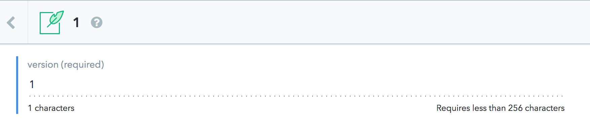
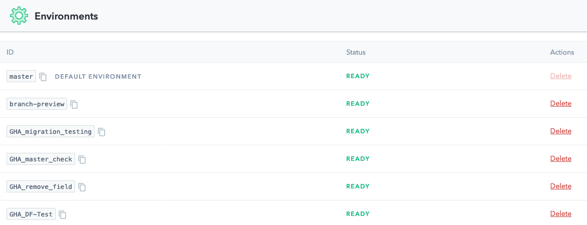

# GitHub Action for Gatsby CLI

This Action wraps the works in conjunction with the [Contentful Migration CLI](https://www.contentful.com/developers/docs/tutorials/general/scripting-migrations/) to enable migrations to be automatically run as part of code deployment. It also includes function to optionally trigger a rebuild via Netlify.

## Usage

```workflow
workflow "Update Content Model" {
  on = "push"
  resolves = ["Contentful Migration"]
}

action "Contentful Migration" {
  uses = "Shy/contentful-action/contentful-migrate@master"
  secrets = ["spaceId", "accessToken","contentfulMigrationLocation"]
}

```

## Usage with Netlify Rebuild

```workflow
workflow "Update Content Model and Rebuild Site" {
  on = "push"
  resolves = ["Netlify Rebuild"]
}

action "Contentful Migration" {
  uses = "Shy/contentful-action/contentful-migrate@master"
  secrets = ["spaceId", "accessToken", "contentfulMigrationLocation"]
}

action "Netlify Rebuild" {
  uses = "Shy/contentful-action/netlify-rebuild@master"
  needs = ["Contentful Migration"]
  secrets = ["netlifyBuildHook"]
}

```


### Environment variables

* `spaceId` - ID of space on Contentful migration should be triggered against.
* `accessToken` -  Contentful Content Management Token .
* `contentfulMigrationLocation` - Directory that contains migrations that need to be executed.
* `netlifyBuildHook` - **Optional**. URL to trigger rebuild on Netlify.


## Project configuration


Similar to our [CircleCI tutorial](https://www.contentful.com/developers/docs/tutorials/general/continuous-integration-with-circleci/), for GitHub Actions to know which migrations it should run, we’ll need to track which migrations have been run by adding a version number into Contentful. We accomplish this in Contentful by creating a new content model with an ID of versionTracking that has a single short-text-field named version.

You’ll also need to create one entry of your new content model with the value 1. We'll be using integers in this action to track migrations.



Next create a new folder in the root directory of your project named migration. This is where we’ll place all our migrations. We’ll need to create an empty migration file to represent the initial setup prior to using this demo. Create 1.js and include the following code:

```JS
module.exports = function runMigration(migration) {
  return;
};

```

For any future migrations, simple add a new JavaScript file of the next integer that contains your migration code. See the migration dictory in this repo for examples. When you commit your new migration, this action will evaluate the avalible migration scripts, compare it against your version tracking content type and run any outstanding migrations.

This action is configured to run utilizing the [enviorments feature on Contentful](https://www.contentful.com/faq/environments/). As you make pull request the action will create a new enviorment on Contentful that you can use to confirm your migrations are configured correctly before commiting to the master branch.




## Example

To see an example repo that is using this action check out the [NYC Twilight Imperium League website](https://github.com/Shy/ti4.nyc-website).
